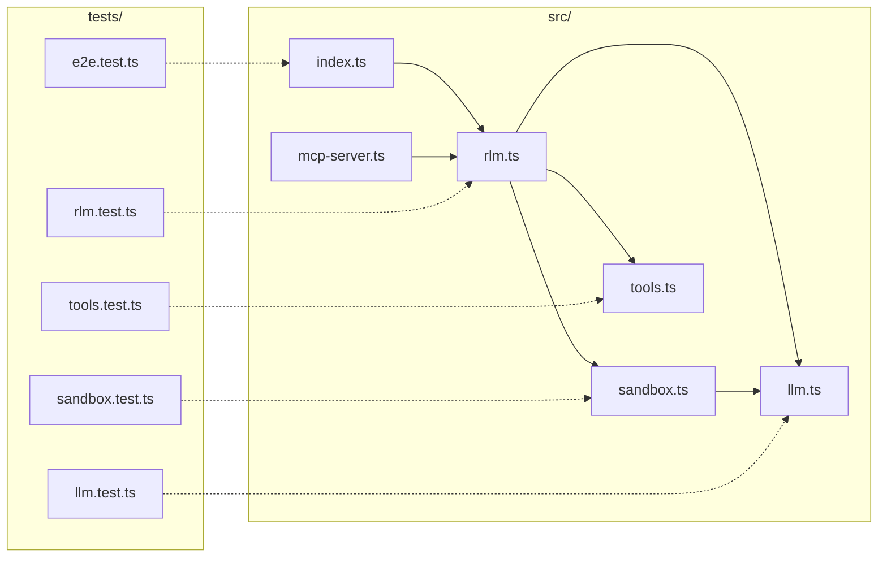
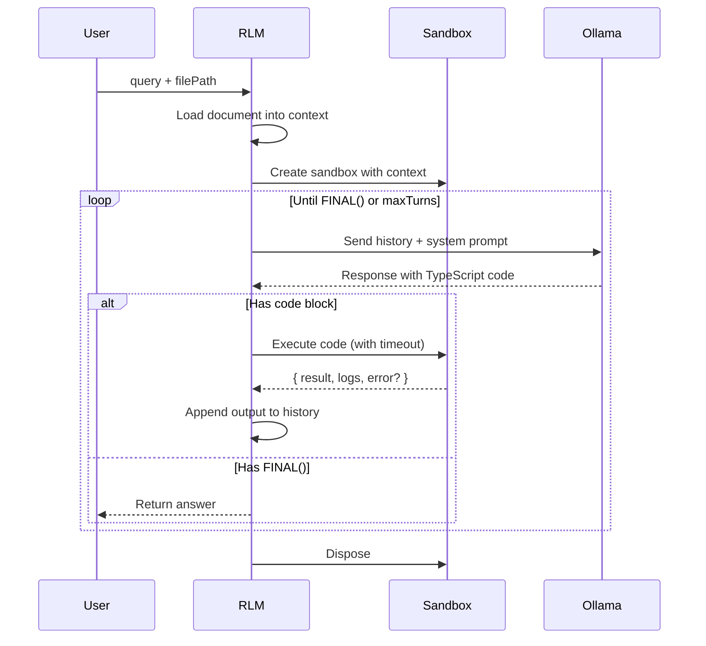

# RLM Architecture & Execution Plan

This document outlines the TDD-based implementation plan for the Recursive Language Model project.

## System Architecture

```mermaid
graph TB
    subgraph "Client Layer"
        CLI[CLI Entry Point]
        MCP[MCP Server]
    end

    subgraph "Core RLM Engine"
        RLM[RLM Executor]
        PROMPT[System Prompt Builder]
        LOOP[Turn Loop Controller]
    end

    subgraph "Sandbox Environment"
        VM[isolated-vm Sandbox]
        CTX[Context Variable]
        MEM[Memory Buffer]
        TOOLS[Sandbox Tools]
    end

    subgraph "Sandbox Tools"
        TS[text_stats]
        FS[fuzzy_search]
        LLM[llm_query]
    end

    subgraph "External Services"
        OLLAMA[Ollama API]
        UTCP[UTCP Registry]
    end

    CLI --> RLM
    MCP --> RLM
    RLM --> PROMPT
    RLM --> LOOP
    LOOP --> VM
    VM --> CTX
    VM --> MEM
    VM --> TOOLS
    TOOLS --> TS
    TOOLS --> FS
    TOOLS --> LLM
    LLM --> OLLAMA
    RLM --> UTCP
```



## Component Diagram



## Execution Flow



---

## Implementation Phases

### Phase 1: Project Setup & LLM Providers

**Goal:** Establish project structure with pluggable LLM provider system.

**Reference:** Basic HTTP client pattern, similar to how [@utcp/http](https://github.com/universal-tool-calling-protocol/typescript-utcp) handles API calls.

#### Files to Create
- `package.json`
- `tsconfig.json`
- `config.json`
- `src/config.ts`
- `src/llm/types.ts`
- `src/llm/ollama.ts`
- `src/llm/deepseek.ts`
- `src/llm/openai.ts`
- `src/llm/index.ts`
- `tests/llm.test.ts`

#### Acceptance Tests (`tests/llm.test.ts`)

```typescript
import { describe, it, expect, vi, beforeEach } from 'vitest';
import { createLLMClient, LLMConfig, ProviderConfig } from '../src/llm';
import { createOllamaProvider } from '../src/llm/ollama';
import { createDeepSeekProvider } from '../src/llm/deepseek';
import { createOpenAIProvider } from '../src/llm/openai';

describe('LLM Provider System', () => {
  describe('Provider Registry', () => {
    it('should create Ollama client from config', () => {
      const query = createLLMClient(
        'ollama',
        { baseUrl: 'http://localhost:11434' },
        { provider: 'ollama', model: 'qwen3-coder:30b' }
      );
      expect(typeof query).toBe('function');
    });

    it('should create DeepSeek client from config', () => {
      const query = createLLMClient(
        'deepseek',
        { baseUrl: 'https://api.deepseek.com', apiKey: 'test-key' },
        { provider: 'deepseek', model: 'deepseek-coder' }
      );
      expect(typeof query).toBe('function');
    });

    it('should create OpenAI client from config', () => {
      const query = createLLMClient(
        'openai',
        { baseUrl: 'https://api.openai.com/v1', apiKey: 'test-key' },
        { provider: 'openai', model: 'gpt-4' }
      );
      expect(typeof query).toBe('function');
    });

    it('should throw for unknown provider', () => {
      expect(() => createLLMClient(
        'unknown-provider',
        { baseUrl: 'http://localhost' },
        { provider: 'unknown', model: 'test' }
      )).toThrow(/unknown.*provider/i);
    });

    it('should resolve environment variables in apiKey', () => {
      process.env.TEST_API_KEY = 'resolved-key';

      // Should not throw when env var is set
      const query = createLLMClient(
        'openai',
        { baseUrl: 'https://api.openai.com/v1', apiKey: '${TEST_API_KEY}' },
        { provider: 'openai', model: 'gpt-4' }
      );
      expect(typeof query).toBe('function');

      delete process.env.TEST_API_KEY;
    });

    it('should throw when env var not set', () => {
      delete process.env.MISSING_KEY;

      expect(() => createLLMClient(
        'openai',
        { baseUrl: 'https://api.openai.com/v1', apiKey: '${MISSING_KEY}' },
        { provider: 'openai', model: 'gpt-4' }
      )).toThrow(/environment variable.*not set/i);
    });
  });

  describe('Ollama Provider', () => {
    it('should format request correctly', async () => {
      const fetchSpy = vi.spyOn(global, 'fetch').mockResolvedValue({
        ok: true,
        json: async () => ({ response: 'test response' })
      } as Response);

      const provider = createOllamaProvider({ baseUrl: 'http://localhost:11434' });
      await provider.query('test prompt', { provider: 'ollama', model: 'qwen3-coder:30b' });

      expect(fetchSpy).toHaveBeenCalledWith(
        'http://localhost:11434/api/generate',
        expect.objectContaining({
          method: 'POST',
          body: expect.stringContaining('"model":"qwen3-coder:30b"')
        })
      );

      fetchSpy.mockRestore();
    });

    it('should handle errors', async () => {
      const fetchSpy = vi.spyOn(global, 'fetch').mockResolvedValue({
        ok: false,
        status: 500,
        statusText: 'Internal Server Error'
      } as Response);

      const provider = createOllamaProvider({ baseUrl: 'http://localhost:11434' });

      await expect(
        provider.query('test', { provider: 'ollama', model: 'test' })
      ).rejects.toThrow(/ollama error.*500/i);

      fetchSpy.mockRestore();
    });
  });

  describe('DeepSeek Provider', () => {
    it('should use chat completions API format', async () => {
      const fetchSpy = vi.spyOn(global, 'fetch').mockResolvedValue({
        ok: true,
        json: async () => ({ choices: [{ message: { content: 'response' } }] })
      } as Response);

      const provider = createDeepSeekProvider({
        baseUrl: 'https://api.deepseek.com',
        apiKey: 'test-key'
      });
      await provider.query('test', { provider: 'deepseek', model: 'deepseek-coder' });

      expect(fetchSpy).toHaveBeenCalledWith(
        'https://api.deepseek.com/chat/completions',
        expect.objectContaining({
          headers: expect.objectContaining({
            'Authorization': 'Bearer test-key'
          }),
          body: expect.stringContaining('"messages"')
        })
      );

      fetchSpy.mockRestore();
    });
  });

  describe('OpenAI Provider', () => {
    it('should use OpenAI chat completions format', async () => {
      const fetchSpy = vi.spyOn(global, 'fetch').mockResolvedValue({
        ok: true,
        json: async () => ({ choices: [{ message: { content: 'response' } }] })
      } as Response);

      const provider = createOpenAIProvider({
        baseUrl: 'https://api.openai.com/v1',
        apiKey: 'sk-test'
      });
      await provider.query('test', { provider: 'openai', model: 'gpt-4' });

      expect(fetchSpy).toHaveBeenCalledWith(
        'https://api.openai.com/v1/chat/completions',
        expect.objectContaining({
          headers: expect.objectContaining({
            'Authorization': 'Bearer sk-test'
          })
        })
      );

      fetchSpy.mockRestore();
    });
  });

  describe('Config Options', () => {
    it('should pass temperature to provider', async () => {
      const fetchSpy = vi.spyOn(global, 'fetch').mockResolvedValue({
        ok: true,
        json: async () => ({ response: 'test' })
      } as Response);

      const provider = createOllamaProvider({ baseUrl: 'http://localhost:11434' });
      await provider.query('test', {
        provider: 'ollama',
        model: 'test',
        options: { temperature: 0.7 }
      });

      expect(fetchSpy).toHaveBeenCalledWith(
        expect.any(String),
        expect.objectContaining({
          body: expect.stringContaining('"temperature":0.7')
        })
      );

      fetchSpy.mockRestore();
    });

    it('should use default temperature when not specified', async () => {
      const fetchSpy = vi.spyOn(global, 'fetch').mockResolvedValue({
        ok: true,
        json: async () => ({ response: 'test' })
      } as Response);

      const provider = createOllamaProvider({ baseUrl: 'http://localhost:11434' });
      await provider.query('test', { provider: 'ollama', model: 'test' });

      expect(fetchSpy).toHaveBeenCalledWith(
        expect.any(String),
        expect.objectContaining({
          body: expect.stringContaining('"temperature":0.2')
        })
      );

      fetchSpy.mockRestore();
    });
  });
});

describe('Config Loader', () => {
  it('should load config from file', async () => {
    const { loadConfig } = await import('../src/config');
    const config = await loadConfig('./config.json');

    expect(config.llm).toBeDefined();
    expect(config.providers).toBeDefined();
    expect(config.sandbox).toBeDefined();
  });

  it('should use defaults for missing values', async () => {
    const { loadConfig } = await import('../src/config');
    const config = await loadConfig('./config.json');

    expect(config.sandbox.maxSubCalls).toBeGreaterThan(0);
    expect(config.rlm.maxTurns).toBeGreaterThan(0);
  });
});
```

#### Implementation Checklist
- [ ] Initialize npm project with TypeScript
- [ ] Configure vitest for testing
- [ ] Create `config.json` with defaults
- [ ] Implement `loadConfig()` in `src/config.ts`
- [ ] Implement `LLMProvider` interface in `src/llm/types.ts`
- [ ] Implement `createOllamaProvider()` adapter
- [ ] Implement `createDeepSeekProvider()` adapter
- [ ] Implement `createOpenAIProvider()` adapter
- [ ] Implement `createLLMClient()` registry with env var resolution
- [ ] Add timeout support via AbortController
- [ ] All tests pass

---

### Phase 2: TypeScript Sandbox

**Goal:** Create an isolated execution environment using `isolated-vm`.

**Reference:** Similar to [codecall's Deno sandbox](https://github.com/zeke-john/codecall) but using isolated-vm for Node.js.

**Critical Note:** `isolated-vm` does not share memory or modules with the host. We cannot `require('fuse.js')` inside the VM. Instead, we bundle a lightweight fuzzy search algorithm as a raw JS string and inject it during sandbox setup.

#### Files to Create
- `src/sandbox.ts`
- `src/fuzzy-search.ts` (standalone algorithm, bundled as string)
- `tests/sandbox.test.ts`

#### Acceptance Tests (`tests/sandbox.test.ts`)

```typescript
import { describe, it, expect, beforeEach, afterEach } from 'vitest';
import { createSandbox, Sandbox, SandboxResult } from '../src/sandbox';

describe('TypeScript Sandbox', () => {
  let sandbox: Sandbox;
  const testContext = 'Line 1\nLine 2\nLine 3\nLine 4\nLine 5\nLine 6\nLine 7\nLine 8\nLine 9\nLine 10';

  beforeEach(async () => {
    sandbox = await createSandbox(testContext, async (prompt) => `Mock response for: ${prompt}`);
  });

  afterEach(() => {
    sandbox.dispose();
  });

  describe('createSandbox', () => {
    it('should create a sandbox with context variable', async () => {
      const result = await sandbox.execute('context.length');
      expect(result.result).toBe(testContext.length);
      expect(result.error).toBeUndefined();
    });

    it('should expose memory array', async () => {
      const result = await sandbox.execute(`
        memory.push({ test: 1 });
        memory.push({ test: 2 });
        memory.length;
      `);
      expect(result.result).toBe(2);
    });

    it('should persist memory across executions', async () => {
      await sandbox.execute('memory.push("first")');
      await sandbox.execute('memory.push("second")');
      const result = await sandbox.execute('memory');
      expect(result.result).toEqual(['first', 'second']);
    });
  });

  describe('console.log capture', () => {
    it('should capture console.log output', async () => {
      const result = await sandbox.execute(`
        console.log('Hello');
        console.log('World');
        42;
      `);
      expect(result.logs).toEqual(['Hello', 'World']);
      expect(result.result).toBe(42);
    });

    it('should handle multiple arguments', async () => {
      const result = await sandbox.execute('console.log("a", "b", "c")');
      expect(result.logs).toEqual(['a b c']);
    });
  });

  describe('text_stats', () => {
    it('should return document metadata without reading full content', async () => {
      const result = await sandbox.execute('text_stats()');
      const stats = result.result;

      expect(stats.length).toBe(testContext.length);
      expect(stats.lineCount).toBe(10);
      expect(stats.sample.start).toContain('Line 1');
      expect(stats.sample.end).toContain('Line 10');
    });

    it('should provide middle sample', async () => {
      const result = await sandbox.execute('text_stats().sample.middle');
      expect(result.result).toContain('Line 5');
    });
  });

  describe('fuzzy_search', () => {
    it('should find exact matches', async () => {
      const result = await sandbox.execute('fuzzy_search("Line 5")');
      expect(result.result.length).toBeGreaterThan(0);
      expect(result.result[0].line).toBe('Line 5');
    });

    it('should find approximate matches', async () => {
      const result = await sandbox.execute('fuzzy_search("Lin 5")'); // Typo
      expect(result.result.length).toBeGreaterThan(0);
      expect(result.result[0].line).toBe('Line 5');
    });

    it('should respect limit parameter', async () => {
      const result = await sandbox.execute('fuzzy_search("Line", 3)');
      expect(result.result.length).toBeLessThanOrEqual(3);
    });

    it('should include line numbers and scores', async () => {
      const result = await sandbox.execute('fuzzy_search("Line 1")[0]');
      expect(result.result).toHaveProperty('lineNum');
      expect(result.result).toHaveProperty('score');
      expect(result.result.lineNum).toBe(1);
    });
  });

  describe('llm_query', () => {
    it('should call the provided LLM function', async () => {
      const result = await sandbox.execute('await llm_query("test prompt")');
      expect(result.result).toBe('Mock response for: test prompt');
    });

    it('should be async', async () => {
      const result = await sandbox.execute(`
        const response = await llm_query("hello");
        response.includes("Mock") ? "success" : "fail";
      `);
      expect(result.result).toBe('success');
    });
  });

  describe('timeout protection', () => {
    it('should terminate infinite loops', async () => {
      const result = await sandbox.execute('while(true) {}', 100);
      expect(result.error).toMatch(/timeout/i);
    });

    it('should allow configurable timeout', async () => {
      const start = Date.now();
      await sandbox.execute('while(true) {}', 200);
      const elapsed = Date.now() - start;
      expect(elapsed).toBeLessThan(500); // Should stop around 200ms
    });
  });

  describe('security isolation', () => {
    it('should not have access to require', async () => {
      const result = await sandbox.execute('typeof require');
      expect(result.result).toBe('undefined');
    });

    it('should not have access to process', async () => {
      const result = await sandbox.execute('typeof process');
      expect(result.result).toBe('undefined');
    });

    it('should not have access to global', async () => {
      const result = await sandbox.execute('typeof global');
      expect(result.result).toBe('undefined');
    });

    it('should not allow filesystem access', async () => {
      const result = await sandbox.execute(`
        try {
          const fs = require('fs');
          'has fs';
        } catch {
          'no fs';
        }
      `);
      expect(result.result).toBe('no fs');
    });
  });

  describe('memory limits', () => {
    it('should enforce memory limits', async () => {
      const result = await sandbox.execute(`
        const arr = [];
        for (let i = 0; i < 100000000; i++) {
          arr.push(new Array(10000).fill('x'));
        }
      `, 5000);
      expect(result.error).toMatch(/memory|heap|allocation/i);
    });
  });

  describe('context leaking protection', () => {
    it('should NOT pass parent history to llm_query', async () => {
      // Track what prompts are sent to the LLM
      const capturedPrompts: string[] = [];
      const trackingLLM = async (prompt: string) => {
        capturedPrompts.push(prompt);
        return 'Sub-LLM response';
      };

      const sandboxWithTracking = await createSandbox(testContext, trackingLLM);

      await sandboxWithTracking.execute(`
        await llm_query("Summarize this chunk: some text here");
      `);

      sandboxWithTracking.dispose();

      // The sub-LLM prompt should ONLY contain what the sandbox code passed
      // It should NOT contain system prompts, user queries, or conversation history
      expect(capturedPrompts[0]).toBe('Summarize this chunk: some text here');
      expect(capturedPrompts[0]).not.toContain('You are a Recursive Language Model');
      expect(capturedPrompts[0]).not.toContain('history');
    });

    it('should isolate sub-LLM calls from parent context variable', async () => {
      const capturedPrompts: string[] = [];
      const trackingLLM = async (prompt: string) => {
        capturedPrompts.push(prompt);
        return 'response';
      };

      const sandboxWithTracking = await createSandbox(testContext, trackingLLM);

      // Even if the sandbox code tries to leak context, the sub-LLM shouldn't see it
      await sandboxWithTracking.execute(`
        await llm_query("Process: " + context.slice(0, 100));
      `);

      sandboxWithTracking.dispose();

      // The sub-LLM sees only the 100 chars, not the full context
      expect(capturedPrompts[0].length).toBeLessThan(200);
    });
  });

  describe('sub-call limiting', () => {
    it('should track number of llm_query calls per execution', async () => {
      let callCount = 0;
      const countingLLM = async (prompt: string) => {
        callCount++;
        return `Response ${callCount}`;
      };

      const sandboxWithCounting = await createSandbox(testContext, countingLLM);

      await sandboxWithCounting.execute(`
        for (let i = 0; i < 3; i++) {
          await llm_query("Call " + i);
        }
      `);

      sandboxWithCounting.dispose();
      expect(callCount).toBe(3);
    });

    it('should enforce maxSubCalls limit', async () => {
      let callCount = 0;
      const countingLLM = async (prompt: string) => {
        callCount++;
        return `Response ${callCount}`;
      };

      const sandboxWithLimit = await createSandbox(testContext, countingLLM, {
        maxSubCalls: 5
      });

      const result = await sandboxWithLimit.execute(`
        const results = [];
        for (let i = 0; i < 100; i++) {
          results.push(await llm_query("Call " + i));
        }
        results.length;
      `);

      sandboxWithLimit.dispose();

      // Should stop at 5 calls, not 100
      expect(callCount).toBe(5);
      expect(result.error).toMatch(/max.*calls|limit.*exceeded/i);
    });
  });
});
```

#### Implementation Checklist
- [ ] Install `isolated-vm`
- [ ] Implement `Sandbox` interface with options type
- [ ] Implement `createSandbox(context, llmFn, options?)` factory
- [ ] Expose `context` variable (read-only)
- [ ] Expose `memory` array with persistence across executions
- [ ] Implement `console.log` capture
- [ ] Implement `text_stats()` function
- [ ] **Implement `fuzzy_search()` as bundled JS string** (Bitap algorithm, no external modules)
- [ ] Implement async `llm_query()` bridge with call counting
- [ ] **Add `maxSubCalls` option to prevent infinite width attacks**
- [ ] Add timeout support
- [ ] Add memory limit configuration
- [ ] **Verify sub-LLM receives ONLY the prompt, no history leakage**
- [ ] All tests pass

---

### Phase 3: UTCP Tool Registration

**Goal:** Register RLM tools via UTCP for typed interfaces.

**Reference:** [@utcp/code-mode](https://github.com/universal-tool-calling-protocol/typescript-utcp) registration pattern.

#### Files to Create
- `src/tools.ts`
- `tests/tools.test.ts`

#### Acceptance Tests (`tests/tools.test.ts`)

```typescript
import { describe, it, expect } from 'vitest';
import {
  createToolRegistry,
  getToolInterfaces,
  ToolRegistry
} from '../src/tools';

describe('UTCP Tool Registration', () => {
  describe('createToolRegistry', () => {
    it('should create a registry with RLM tools', () => {
      const registry = createToolRegistry();
      expect(registry.tools).toHaveLength(5); // llm_query, text_stats, fuzzy_search, slice, match
    });

    it('should include llm_query tool', () => {
      const registry = createToolRegistry();
      const tool = registry.tools.find(t => t.name === 'llm_query');
      expect(tool).toBeDefined();
      expect(tool?.description).toContain('sub-LLM');
    });

    it('should include text_stats tool', () => {
      const registry = createToolRegistry();
      const tool = registry.tools.find(t => t.name === 'text_stats');
      expect(tool).toBeDefined();
      expect(tool?.description).toContain('metadata');
    });

    it('should include fuzzy_search tool', () => {
      const registry = createToolRegistry();
      const tool = registry.tools.find(t => t.name === 'fuzzy_search');
      expect(tool).toBeDefined();
      expect(tool?.parameters.properties).toHaveProperty('query');
    });
  });

  describe('getToolInterfaces', () => {
    it('should generate TypeScript interface string', () => {
      const registry = createToolRegistry();
      const interfaces = getToolInterfaces(registry);

      expect(interfaces).toContain('llm_query');
      expect(interfaces).toContain('text_stats');
      expect(interfaces).toContain('fuzzy_search');
    });

    it('should include parameter types', () => {
      const registry = createToolRegistry();
      const interfaces = getToolInterfaces(registry);

      expect(interfaces).toContain('prompt: string');
      expect(interfaces).toContain('query: string');
      expect(interfaces).toContain('limit?: number');
    });

    it('should include return type hints', () => {
      const registry = createToolRegistry();
      const interfaces = getToolInterfaces(registry);

      expect(interfaces).toContain('Promise<string>'); // llm_query
      expect(interfaces).toContain('{ length: number'); // text_stats
    });
  });

  describe('tool schemas', () => {
    it('should have valid JSON Schema for each tool', () => {
      const registry = createToolRegistry();

      for (const tool of registry.tools) {
        expect(tool.parameters).toHaveProperty('type', 'object');
        expect(tool.parameters).toHaveProperty('properties');
      }
    });

    it('should mark required parameters', () => {
      const registry = createToolRegistry();
      const fuzzySearch = registry.tools.find(t => t.name === 'fuzzy_search');

      expect(fuzzySearch?.parameters.required).toContain('query');
      expect(fuzzySearch?.parameters.required).not.toContain('limit');
    });
  });
});
```

#### Implementation Checklist
- [ ] Define `Tool` interface matching UTCP schema
- [ ] Define `ToolRegistry` interface
- [ ] Implement `createToolRegistry()` with all RLM tools
- [ ] Implement `getToolInterfaces()` for TypeScript generation
- [ ] Include proper JSON Schema for each tool
- [ ] All tests pass

---

### Phase 4: RLM Execution Loop

**Goal:** Implement the main RLM controller with iterative turn-based execution.

**Reference:** Turn loop pattern from [RLM paper](https://arxiv.org/abs/2512.24601).

#### Files to Create
- `src/rlm.ts`
- `tests/rlm.test.ts`

#### Acceptance Tests (`tests/rlm.test.ts`)

```typescript
import { describe, it, expect, vi, beforeEach } from 'vitest';
import {
  runRLM,
  buildSystemPrompt,
  extractCode,
  extractFinalAnswer,
  RLMOptions
} from '../src/rlm';

// Mock the LLM for controlled testing
const mockLLM = vi.fn();

describe('RLM Executor', () => {
  beforeEach(() => {
    mockLLM.mockReset();
  });

  describe('buildSystemPrompt', () => {
    it('should include context length', () => {
      const prompt = buildSystemPrompt(50000, '');
      expect(prompt).toContain('50,000');
    });

    it('should include tool interfaces', () => {
      const interfaces = 'function text_stats(): Stats';
      const prompt = buildSystemPrompt(1000, interfaces);
      expect(prompt).toContain('text_stats');
    });

    it('should include memory usage instructions', () => {
      const prompt = buildSystemPrompt(1000, '');
      expect(prompt).toContain('memory');
      expect(prompt).toContain('console.log');
    });

    it('should include FINAL termination instructions', () => {
      const prompt = buildSystemPrompt(1000, '');
      expect(prompt).toContain('FINAL(');
      expect(prompt).toContain('FINAL_VAR(');
    });
  });

  describe('extractCode', () => {
    it('should extract TypeScript code blocks', () => {
      const response = 'Some text\n```typescript\nconst x = 1;\n```\nMore text';
      const code = extractCode(response);
      expect(code).toBe('const x = 1;');
    });

    it('should return null if no code block', () => {
      const response = 'Just plain text';
      const code = extractCode(response);
      expect(code).toBeNull();
    });

    it('should handle multiple code blocks (take first)', () => {
      const response = '```typescript\nfirst\n```\n```typescript\nsecond\n```';
      const code = extractCode(response);
      expect(code).toBe('first');
    });

    it('should handle js/javascript blocks too', () => {
      const response = '```javascript\nconst y = 2;\n```';
      const code = extractCode(response);
      expect(code).toBe('const y = 2;');
    });
  });

  describe('extractFinalAnswer', () => {
    it('should extract <<<FINAL>>> delimited answer', () => {
      const response = 'Some reasoning here\n<<<FINAL>>>\nThe answer is 42\n<<<END>>>';
      const answer = extractFinalAnswer(response);
      expect(answer).toBe('The answer is 42');
    });

    it('should extract FINAL_VAR(variableName)', () => {
      const response = 'FINAL_VAR(memory)';
      const answer = extractFinalAnswer(response);
      expect(answer).toEqual({ type: 'var', name: 'memory' });
    });

    it('should return null if no final marker', () => {
      const response = 'Still working...';
      const answer = extractFinalAnswer(response);
      expect(answer).toBeNull();
    });

    it('should handle multiline answers', () => {
      const response = '<<<FINAL>>>\nLine 1\nLine 2\nLine 3\n<<<END>>>';
      const answer = extractFinalAnswer(response);
      expect(answer).toContain('Line 1');
      expect(answer).toContain('Line 2');
    });

    it('should handle quotes in answer without breaking', () => {
      // This was a failure mode with regex: FINAL("He said "hello".")
      const response = '<<<FINAL>>>\nHe said "hello" and she said "goodbye".\n<<<END>>>';
      const answer = extractFinalAnswer(response);
      expect(answer).toContain('"hello"');
      expect(answer).toContain('"goodbye"');
    });

    it('should handle JSON in answer', () => {
      const response = '<<<FINAL>>>\n{"key": "value", "nested": {"a": 1}}\n<<<END>>>';
      const answer = extractFinalAnswer(response);
      const parsed = JSON.parse(answer as string);
      expect(parsed.key).toBe('value');
    });

    it('should trim whitespace from answer', () => {
      const response = '<<<FINAL>>>\n   \n  The answer  \n   \n<<<END>>>';
      const answer = extractFinalAnswer(response);
      expect(answer).toBe('The answer');
    });
  });

  describe('runRLM', () => {
    it('should load document and create sandbox', async () => {
      mockLLM.mockResolvedValueOnce('<<<FINAL>>>\ndone\n<<<END>>>');

      const result = await runRLM('test query', './test-fixtures/small.txt', {
        llmClient: mockLLM,
        maxTurns: 1
      });

      expect(result).toBe('done');
    });

    it('should execute code and feed results back', async () => {
      mockLLM
        .mockResolvedValueOnce('```typescript\nconsole.log(context.length);\n```')
        .mockResolvedValueOnce('<<<FINAL>>>\nprocessed\n<<<END>>>');

      const result = await runRLM('test query', './test-fixtures/small.txt', {
        llmClient: mockLLM,
        maxTurns: 5
      });

      expect(mockLLM).toHaveBeenCalledTimes(2);
      // Second call should include sandbox output
      const secondCall = mockLLM.mock.calls[1][0];
      expect(secondCall).toContain('Sandbox execution');
    });

    it('should stop at maxTurns', async () => {
      mockLLM.mockResolvedValue('```typescript\nconsole.log("loop");\n```');

      const result = await runRLM('test query', './test-fixtures/small.txt', {
        llmClient: mockLLM,
        maxTurns: 3
      });

      expect(mockLLM).toHaveBeenCalledTimes(3);
      expect(result).toContain('Max turns');
    });

    it('should handle sandbox errors gracefully', async () => {
      mockLLM
        .mockResolvedValueOnce('```typescript\nthrow new Error("test error");\n```')
        .mockResolvedValueOnce('<<<FINAL>>>\nrecovered\n<<<END>>>');

      const result = await runRLM('test query', './test-fixtures/small.txt', {
        llmClient: mockLLM,
        maxTurns: 5
      });

      expect(result).toBe('recovered');
      const secondCall = mockLLM.mock.calls[1][0];
      expect(secondCall).toContain('Error');
    });

    it('should feed errors back for self-correction', async () => {
      mockLLM
        // Turn 1: Syntax error
        .mockResolvedValueOnce('```typescript\nconst x = {\n```')
        // Turn 2: Model sees error and fixes
        .mockResolvedValueOnce('```typescript\nconst x = { valid: true };\nconsole.log(x);\n```')
        // Turn 3: Success
        .mockResolvedValueOnce('<<<FINAL>>>\nFixed and completed\n<<<END>>>');

      const result = await runRLM('test query', './test-fixtures/small.txt', {
        llmClient: mockLLM,
        maxTurns: 5
      });

      // Second call should include the syntax error message
      const secondCall = mockLLM.mock.calls[1][0];
      expect(secondCall).toMatch(/error|syntax|unexpected/i);

      // Model should recover
      expect(result).toBe('Fixed and completed');
    });

    it('should include helpful error context for model recovery', async () => {
      mockLLM
        .mockResolvedValueOnce('```typescript\nundefinedVariable.foo()\n```')
        .mockResolvedValueOnce('<<<FINAL>>>\nrecovered\n<<<END>>>');

      await runRLM('test query', './test-fixtures/small.txt', {
        llmClient: mockLLM,
        maxTurns: 5
      });

      const secondCall = mockLLM.mock.calls[1][0];
      // Error message should help model understand what went wrong
      expect(secondCall).toContain('undefinedVariable');
      expect(secondCall).toMatch(/not defined|undefined|ReferenceError/i);
    });

    it('should respect turnTimeoutMs', async () => {
      mockLLM.mockResolvedValueOnce('```typescript\nwhile(true){}\n```');

      const start = Date.now();
      await runRLM('test query', './test-fixtures/small.txt', {
        llmClient: mockLLM,
        maxTurns: 1,
        turnTimeoutMs: 200
      });
      const elapsed = Date.now() - start;

      expect(elapsed).toBeLessThan(1000);
    });

    it('should resolve FINAL_VAR from sandbox', async () => {
      mockLLM
        .mockResolvedValueOnce('```typescript\nmemory.push({key: "value"});\n```')
        .mockResolvedValueOnce('FINAL_VAR(memory)');

      const result = await runRLM('test query', './test-fixtures/small.txt', {
        llmClient: mockLLM,
        maxTurns: 5
      });

      expect(result).toEqual([{ key: 'value' }]);
    });

    it('should accumulate history across turns', async () => {
      mockLLM
        .mockResolvedValueOnce('```typescript\nconst stats = text_stats();\nconsole.log(stats.lineCount);\n```')
        .mockResolvedValueOnce('```typescript\nmemory.push("found");\n```')
        .mockResolvedValueOnce('<<<FINAL>>>\ndone\n<<<END>>>');

      await runRLM('test query', './test-fixtures/small.txt', {
        llmClient: mockLLM,
        maxTurns: 5
      });

      // Third call should have full history
      const thirdCall = mockLLM.mock.calls[2][0];
      expect(thirdCall).toContain('Turn'); // Should reference earlier turns
    });

    it('should enforce maxSubCalls per turn', async () => {
      mockLLM
        .mockResolvedValueOnce(`\`\`\`typescript
          // Try to make 100 sub-calls
          for (let i = 0; i < 100; i++) {
            await llm_query("call " + i);
          }
        \`\`\``)
        .mockResolvedValueOnce('<<<FINAL>>>\nlimited\n<<<END>>>');

      await runRLM('test query', './test-fixtures/small.txt', {
        llmClient: mockLLM,
        maxTurns: 5,
        maxSubCalls: 5
      });

      const secondCall = mockLLM.mock.calls[1][0];
      // Should report that limit was hit
      expect(secondCall).toMatch(/limit|max.*calls|exceeded/i);
    });

    it('should warn model about full-context iteration', async () => {
      // The system prompt should discourage looping through entire context
      const result = await buildSystemPrompt(1000000, '');
      expect(result).toMatch(/do not.*loop.*0.*1,000,000|sample first/i);
    });
  });

  describe('integration with real files', () => {
    it('should process a large document', async () => {
      // Simulate an LLM that explores then answers
      mockLLM
        .mockResolvedValueOnce('```typescript\nconst s = text_stats();\nconsole.log(`Lines: ${s.lineCount}`);\n```')
        .mockResolvedValueOnce('FINAL("Document has many lines")');

      const result = await runRLM(
        'How many lines?',
        './test-fixtures/moby-dick-excerpt.txt',
        { llmClient: mockLLM, maxTurns: 5 }
      );

      expect(result).toContain('lines');
    });
  });
});
```

#### Implementation Checklist
- [ ] Implement `buildSystemPrompt()` with anti-iteration warning
- [ ] Implement `extractCode()` with regex (handle ts/js/typescript/javascript)
- [ ] **Implement `extractFinalAnswer()` with `<<<FINAL>>>...<<<END>>>` delimiters** (not regex on quotes)
- [ ] Implement `runRLM()` main function with options interface
- [ ] Integrate sandbox creation and disposal
- [ ] Implement turn loop with history accumulation
- [ ] Handle `FINAL_VAR` resolution from sandbox
- [ ] **Feed sandbox errors back to model for self-correction**
- [ ] **Pass `maxSubCalls` to sandbox to prevent infinite width**
- [ ] Add proper error handling with helpful context
- [ ] All tests pass

---

### Phase 5: CLI Entry Point

**Goal:** Create the command-line interface.

#### Files to Create
- `src/index.ts`
- `tests/cli.test.ts`

#### Acceptance Tests (`tests/cli.test.ts`)

```typescript
import { describe, it, expect } from 'vitest';
import { execSync } from 'child_process';
import { resolve } from 'path';

describe('CLI', () => {
  const cli = (args: string) => {
    try {
      return execSync(`npx tsx src/index.ts ${args}`, {
        cwd: resolve(__dirname, '..'),
        encoding: 'utf-8',
        timeout: 60000
      });
    } catch (e: any) {
      return e.stdout || e.message;
    }
  };

  describe('argument parsing', () => {
    it('should show usage with --help', () => {
      const output = cli('--help');
      expect(output).toContain('Usage');
      expect(output).toContain('query');
      expect(output).toContain('file');
    });

    it('should require query and file arguments', () => {
      const output = cli('');
      expect(output).toMatch(/missing|required|usage/i);
    });

    it('should accept query and file positional args', () => {
      const output = cli('"test query" ./test-fixtures/small.txt --dry-run');
      expect(output).toContain('Query: test query');
      expect(output).toContain('File: ./test-fixtures/small.txt');
    });
  });

  describe('options', () => {
    it('should accept --max-turns option', () => {
      const output = cli('"query" ./test-fixtures/small.txt --max-turns 5 --dry-run');
      expect(output).toContain('Max turns: 5');
    });

    it('should accept --timeout option', () => {
      const output = cli('"query" ./test-fixtures/small.txt --timeout 60000 --dry-run');
      expect(output).toContain('Timeout: 60000');
    });

    it('should accept --model option', () => {
      const output = cli('"query" ./test-fixtures/small.txt --model llama3 --dry-run');
      expect(output).toContain('Model: llama3');
    });

    it('should accept --verbose flag', () => {
      const output = cli('"query" ./test-fixtures/small.txt --verbose --dry-run');
      expect(output).toContain('Verbose: true');
    });
  });

  describe('file handling', () => {
    it('should error on non-existent file', () => {
      const output = cli('"query" ./nonexistent.txt');
      expect(output).toMatch(/not found|no such file|ENOENT/i);
    });

    it('should accept absolute paths', () => {
      const absPath = resolve(__dirname, '../test-fixtures/small.txt');
      const output = cli(`"query" "${absPath}" --dry-run`);
      expect(output).toContain(absPath);
    });
  });
});
```

#### Implementation Checklist
- [ ] Parse command-line arguments
- [ ] Implement `--help` output
- [ ] Validate required arguments
- [ ] Implement `--dry-run` for testing
- [ ] Add `--verbose` mode
- [ ] Add `--max-turns`, `--timeout`, `--model` options
- [ ] Handle file path resolution
- [ ] All tests pass

---

### Phase 6: MCP Server

**Goal:** Create an MCP server for integration with Claude Desktop and other clients.

**Reference:** [@modelcontextprotocol/sdk](https://github.com/modelcontextprotocol/typescript-sdk) patterns.

#### Files to Create
- `src/mcp-server.ts`
- `tests/mcp.test.ts`

#### Acceptance Tests (`tests/mcp.test.ts`)

```typescript
import { describe, it, expect, beforeAll, afterAll } from 'vitest';
import { spawn, ChildProcess } from 'child_process';
import { Client } from '@modelcontextprotocol/sdk/client/index.js';
import { StdioClientTransport } from '@modelcontextprotocol/sdk/client/stdio.js';

describe('MCP Server', () => {
  let serverProcess: ChildProcess;
  let client: Client;

  beforeAll(async () => {
    // Start the MCP server
    serverProcess = spawn('npx', ['tsx', 'src/mcp-server.ts'], {
      stdio: ['pipe', 'pipe', 'pipe']
    });

    const transport = new StdioClientTransport({
      command: 'npx',
      args: ['tsx', 'src/mcp-server.ts']
    });

    client = new Client({ name: 'test-client', version: '1.0.0' }, {});
    await client.connect(transport);
  });

  afterAll(async () => {
    await client.close();
    serverProcess.kill();
  });

  describe('server info', () => {
    it('should report server name and version', async () => {
      const info = client.getServerCapabilities();
      expect(info).toBeDefined();
    });
  });

  describe('tool listing', () => {
    it('should list analyze_document tool', async () => {
      const tools = await client.listTools();
      const analyzeDoc = tools.tools.find(t => t.name === 'analyze_document');

      expect(analyzeDoc).toBeDefined();
      expect(analyzeDoc?.description).toContain('Recursive Language Model');
    });

    it('should have correct input schema', async () => {
      const tools = await client.listTools();
      const analyzeDoc = tools.tools.find(t => t.name === 'analyze_document');

      expect(analyzeDoc?.inputSchema.properties).toHaveProperty('query');
      expect(analyzeDoc?.inputSchema.properties).toHaveProperty('filePath');
      expect(analyzeDoc?.inputSchema.required).toContain('query');
      expect(analyzeDoc?.inputSchema.required).toContain('filePath');
    });
  });

  describe('tool execution', () => {
    it('should execute analyze_document and return result', async () => {
      const result = await client.callTool({
        name: 'analyze_document',
        arguments: {
          query: 'What is the first line?',
          filePath: './test-fixtures/small.txt'
        }
      });

      expect(result.content).toBeDefined();
      expect(result.content[0].type).toBe('text');
    });

    it('should handle missing file gracefully', async () => {
      const result = await client.callTool({
        name: 'analyze_document',
        arguments: {
          query: 'test',
          filePath: './nonexistent.txt'
        }
      });

      expect(result.content[0].text).toMatch(/not found|error/i);
    });

    it('should support optional maxTurns parameter', async () => {
      const result = await client.callTool({
        name: 'analyze_document',
        arguments: {
          query: 'test',
          filePath: './test-fixtures/small.txt',
          maxTurns: 3
        }
      });

      expect(result.content).toBeDefined();
    });
  });

  describe('resource exposure (optional)', () => {
    it('should list available document resources', async () => {
      const resources = await client.listResources();
      // If implemented, check for document resources
      expect(resources).toBeDefined();
    });
  });
});
```

#### Implementation Checklist
- [ ] Install `@modelcontextprotocol/sdk`
- [ ] Create MCP server with stdio transport
- [ ] Register `analyze_document` tool
- [ ] Implement tool handler calling `runRLM()`
- [ ] Add proper error handling
- [ ] All tests pass

---

### Phase 7: End-to-End Integration Tests

**Goal:** Verify the complete system works together.

#### Files to Create
- `tests/e2e.test.ts`
- `test-fixtures/` directory with sample files

#### Acceptance Tests (`tests/e2e.test.ts`)

```typescript
import { describe, it, expect } from 'vitest';
import { runRLM } from '../src/rlm';

// These tests require Ollama running with qwen3-coder
describe.skipIf(!process.env.RUN_E2E)('E2E Integration', () => {

  describe('document analysis', () => {
    it('should summarize a short document', async () => {
      const result = await runRLM(
        'Summarize this document in one sentence.',
        './test-fixtures/short-article.txt',
        { maxTurns: 10, turnTimeoutMs: 60000 }
      );

      expect(typeof result).toBe('string');
      expect(result.length).toBeGreaterThan(20);
    }, 120000);

    it('should find specific information', async () => {
      const result = await runRLM(
        'What color is mentioned most frequently?',
        './test-fixtures/colors.txt',
        { maxTurns: 10, turnTimeoutMs: 60000 }
      );

      expect(result.toLowerCase()).toMatch(/red|blue|green|white/);
    }, 120000);

    it('should handle large documents', async () => {
      const result = await runRLM(
        'How many chapters are in this book?',
        './test-fixtures/moby-dick.txt',
        { maxTurns: 15, turnTimeoutMs: 60000 }
      );

      expect(result).toMatch(/\d+/); // Should contain a number
    }, 300000);
  });

  describe('code analysis', () => {
    it('should analyze a codebase', async () => {
      const result = await runRLM(
        'List all the exported functions in this file.',
        './test-fixtures/sample-code.ts',
        { maxTurns: 10, turnTimeoutMs: 60000 }
      );

      expect(result).toBeDefined();
    }, 120000);
  });

  describe('memory usage', () => {
    it('should use memory buffer for complex queries', async () => {
      const result = await runRLM(
        'Find all mentions of "whale" and categorize them by context (hunting, description, metaphor).',
        './test-fixtures/moby-dick-excerpt.txt',
        { maxTurns: 15, turnTimeoutMs: 60000 }
      );

      expect(result).toContain('whale');
    }, 300000);
  });

  describe('error recovery', () => {
    it('should recover from code errors', async () => {
      // The LLM might write buggy code initially
      const result = await runRLM(
        'Count the words in this document.',
        './test-fixtures/small.txt',
        { maxTurns: 10, turnTimeoutMs: 60000 }
      );

      expect(result).toBeDefined();
    }, 120000);
  });
});
```

#### Implementation Checklist
- [ ] Create `test-fixtures/` directory
- [ ] Add sample text files of various sizes
- [ ] Add sample code files
- [ ] Write E2E tests (skipped by default)
- [ ] Document how to run E2E tests
- [ ] All tests pass when Ollama is available

---

## Test Fixtures Required

```
test-fixtures/
├── small.txt              # ~100 lines, simple text
├── short-article.txt      # ~500 lines, article format
├── colors.txt             # Text with color words for counting
├── moby-dick-excerpt.txt  # ~5000 lines from Moby Dick
├── moby-dick.txt          # Full text (~22000 lines)
└── sample-code.ts         # TypeScript file for code analysis
```

---

## Development Workflow

```bash
# Phase 1: Setup
npm init -y
npm install typescript vitest isolated-vm fuse.js @modelcontextprotocol/sdk
npm install -D @types/node tsx

# Run tests for current phase
npm test -- --run tests/llm.test.ts

# Run all tests
npm test

# Run with coverage
npm test -- --coverage

# Run E2E tests (requires Ollama)
RUN_E2E=1 npm test -- --run tests/e2e.test.ts
```

---

## Dependencies Summary

| Package | Purpose | Phase |
|---------|---------|-------|
| `typescript` | Language | 1 |
| `vitest` | Testing | 1 |
| `tsx` | TS execution | 1 |
| `isolated-vm` | Sandbox | 2 |
| `fuse.js` | Fuzzy search | 2 |
| `@modelcontextprotocol/sdk` | MCP server | 6 |
| `@utcp/code-mode` | Tool interfaces (optional) | 3 |

---

## References

- [RLM Paper](https://arxiv.org/abs/2512.24601) - Core algorithm
- [code-mode](https://github.com/universal-tool-calling-protocol/code-mode) - Sandbox patterns
- [typescript-utcp](https://github.com/universal-tool-calling-protocol/typescript-utcp) - UTCP SDK
- [codecall](https://github.com/zeke-john/codecall) - Alternative sandbox implementation
- [MCP TypeScript SDK](https://github.com/modelcontextprotocol/typescript-sdk) - MCP server patterns
